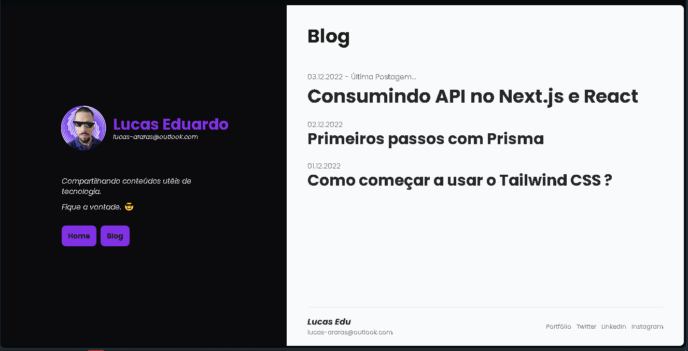
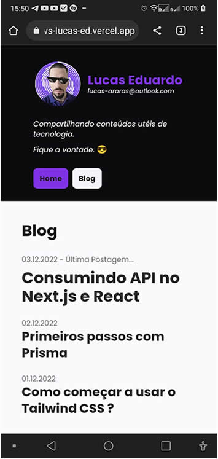

# Blog com API do TabNews

Blog feito em NextJS com as APIs do [TabNews](https://www.tabnews.com.br) ,
foi feito uma refatoração do projeto, de cordo com a minha necessidade !


## Instalação

- Faça o download do projeto.
- Instale as dependências:

```bash
  npm install
```
- crie dentro da raiz um arquivo .env e determine a varíavel de ambiente:
 ```bash
  BLOG_PROVIDER_BASE_API=https://www.tabnews.com.br/api/v1
```
- Só por pra rodar o projeto localmente com o comando:
```bash
  npm run dev
```
## Layout




## Mobile




## Referência

 - [Gustavo Sales](https://github.com/guscsales/tab-news-blog)
 - [Filipe Deschamps |TabNews](https://github.com/filipedeschamps/tabnews.com.br)
 - [thonlabs](https://www.thonlabs.io/)


## Demonstração
 [Acesse aqui.](https://blog-tab-news-lucas-ed.vercel.app)


## Licença

[MIT](https://choosealicense.com/licenses/mit/)

